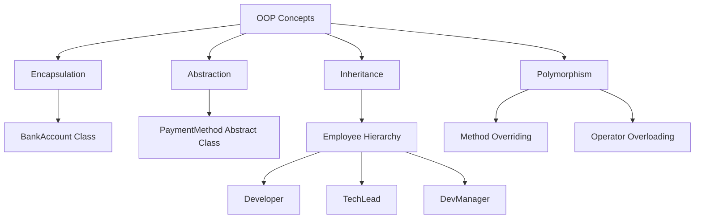
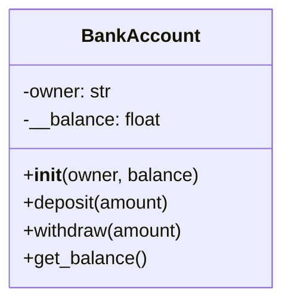
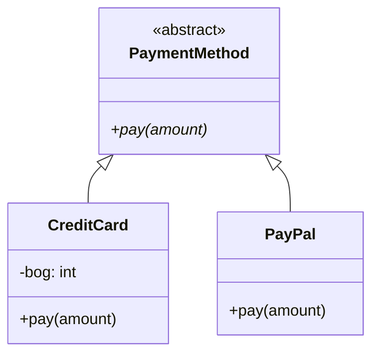
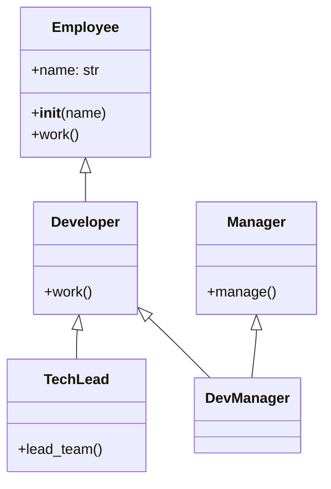
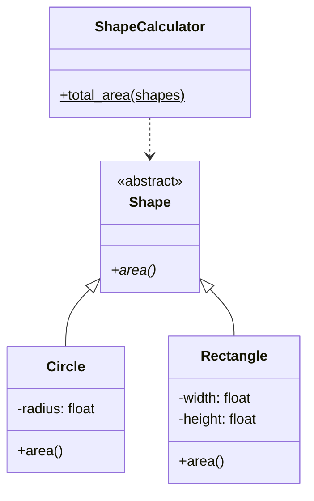
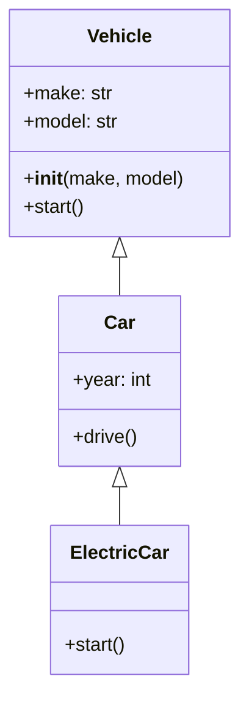
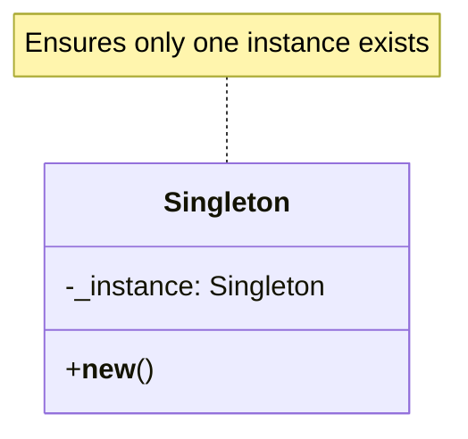
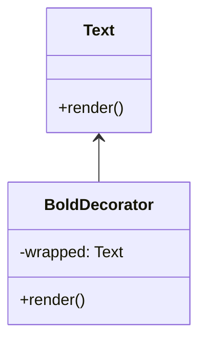
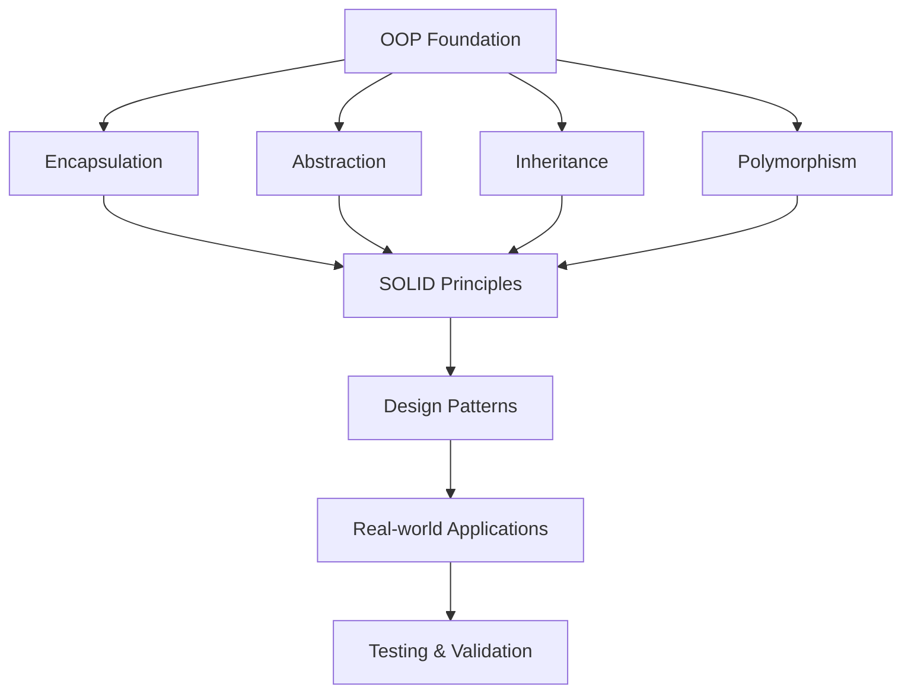

# Python Object-Oriented Programming for Low-Level Design (LLD)

## 📋 Overview

This repository demonstrates comprehensive Object-Oriented Programming (OOP) concepts in Python specifically tailored for Low-Level Design (LLD) applications. It covers fundamental OOP principles, SOLID design principles, design patterns, and practical implementations with real-world examples.

## 🎯 Key Features

- **Complete OOP Fundamentals**: Encapsulation, Abstraction, Inheritance, and Polymorphism
- **SOLID Principles**: All five principles with practical implementations
- **Design Patterns**: Singleton, Decorator, and Factory patterns
- **Advanced Python Features**: Special methods, decorators, and property usage
- **Testing Integration**: Examples with pytest framework
- **UML Visualization**: Class diagrams for better understanding

## 🏗️ System Architecture

### Core OOP Concepts Implementation

### Class Diagrams

#### 1. Banking System (Encapsulation Example)

#### 2. Payment System (Abstraction Example)

#### 3. Employee Hierarchy (Inheritance Example)

#### 4. Shape Calculator (SOLID Principles)

#### 5. Vehicle System (LSP Example)

## 🔧 Key Components

### 1. Encapsulation Features
- Private attribute access control (`__balance`)
- Protected methods and data hiding
- Controlled data access through getter/setter methods

### 2. Abstraction Implementation
- Abstract base classes using `abc` module
- Interface definition and enforcement
- Implementation hiding with clear public APIs

### 3. Inheritance Types
- **Single Inheritance**: Employee → Developer
- **Multilevel Inheritance**: Employee → Developer → TechLead  
- **Multiple Inheritance**: DevManager inherits from both Developer and Manager

### 4. Polymorphism Examples
- Method overriding in inheritance hierarchies
- Operator overloading (`__add__`, `__str__`)
- Duck typing for flexible interfaces

### 5. SOLID Principles Implementation

#### Single Responsibility Principle (SRP)
- Separate classes for `BankAccount` and `Transaction`
- Each class handles one specific responsibility

#### Open-Closed Principle (OCP)
- Shape hierarchy extensible without modifying existing code
- New shapes can be added by extending `Shape` abstract class

#### Liskov Substitution Principle (LSP)
- `ElectricCar` can substitute `Car` without breaking functionality
- Proper inheritance hierarchy maintenance

#### Interface Segregation Principle (ISP)
- Separate interfaces for `AreaCalculable` and `PerimeterCalculable`
- Classes implement only needed interfaces

#### Dependency Inversion Principle (DIP)
- High-level modules depend on abstractions
- Notification system uses dependency injection

## 🎨 Design Patterns

### Singleton Pattern

### Decorator Pattern

## 📊 Testing Integration

The codebase includes comprehensive testing examples using pytest:

- **Unit Testing**: Calculator class with test methods
- **Fixture Usage**: Logger class testing
- **Test Organization**: Proper test class structure

## 🚀 Usage Examples

### Basic Usage
The code demonstrates practical applications including:

- Banking system with secure balance management
- Payment processing with multiple providers
- Employee management with role hierarchies
- Geometric calculations with extensible shape system
- Vehicle management with inheritance

### Advanced Features
- Property decorators for controlled attribute access
- Class methods and static methods usage
- Special method implementations (`__init__`, `__del__`, `__str__`)
- Exception handling and validation

## 📚 Best Practices Demonstrated

1. **Meaningful Naming**: Descriptive class and method names
2. **PEP 8 Compliance**: Python style guide adherence
3. **Property Usage**: Controlled attribute access
4. **Abstract Base Classes**: Clear interface definitions
5. **Composition Over Inheritance**: Where appropriate
6. **Exception Handling**: Robust error management
7. **Documentation**: Clear code documentation
8. **Type Safety**: Proper validation and error handling

## 🎓 Learning Outcomes

After studying this codebase, you will understand:

- How to implement all four OOP pillars in Python
- SOLID principles application in real scenarios
- Design pattern implementation and usage
- Professional Python OOP coding practices
- Integration of OOP with testing frameworks
- UML diagram interpretation and system design

## 📈 System Flow

## 🔍 Code Quality Features

- **Modular Design**: Each concept in separate, focused classes
- **Extensibility**: Easy to add new features without breaking existing code
- **Maintainability**: Clear separation of concerns
- **Testability**: Comprehensive test coverage examples
- **Scalability**: Patterns suitable for large-scale applications

This implementation serves as a comprehensive reference for Python OOP in Low-Level Design scenarios, providing both theoretical understanding and practical implementation examples.